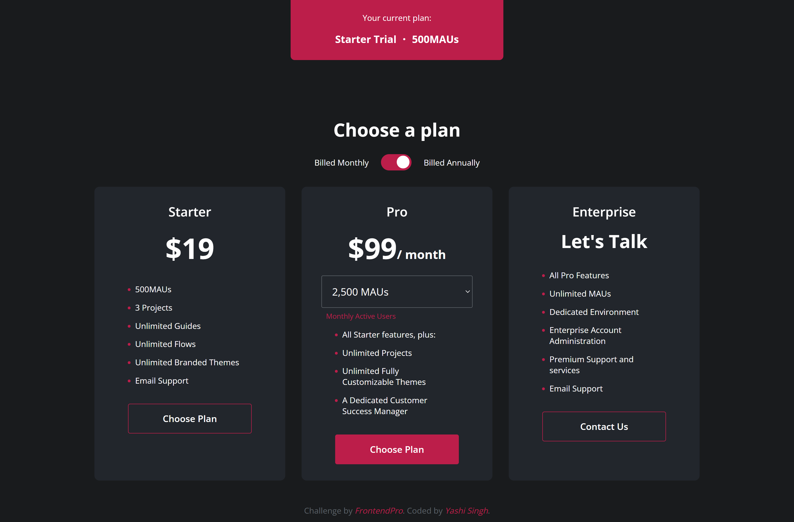
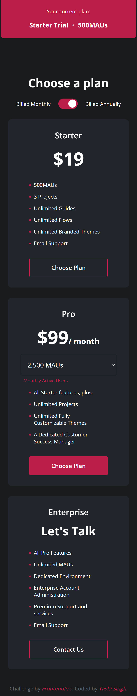

# FrontendPro - Pricing Card Page Solution

This is a solution to the **Pricing Card Page** challenge from FrontendPro. The goal of this challenge is to create a responsive and interactive pricing card page that includes monthly and yearly pricing toggles, as well as dropdown options for selecting monthly active users (MAUs) for the **Pro** plan.

**Challenge URL**: [FrontendPro - Pricing Card Page](https://www.frontendpro.dev/frontend-coding-challenges/pricing-card-page-0nkDZvhphqvSP3b9hKIc)

## Table of Contents

- [Overview](#overview)
  - [The Challenge](#the-challenge)
  - [Screenshot](#screenshot)
  - [Links](#links)
- [My Process](#my-process)
  - [Built With](#built-with)
  - [Installation](#installation)
  - [Continued Development](#continued-development)
  - [Useful Resources](#useful-resources)
- [Author](#author)
- [Acknowledgments](#acknowledgments)

## Overview

### The Challenge

Users should be able to:

- View the optimal layout for the page depending on their device's screen size.
- See hover states for all interactive elements on the page.
- Toggle between **Monthly** and **Yearly** billing for **Pro** plan options, with the monthly active user (MAU) options updating accordingly.
- Have a clean, responsive, and intuitive user interface.

### Screenshot

**Desktop Design**


**Mobile Design**


### Links

- Solution URL: [Solution](https://your-solution-url.com)
- Live Site URL: [Live](https://your-live-site-url.com)

## My Process

### Built With

- **HTML5**: Semantic and accessible markup for the structure of the page.
- **LESS**: A CSS preprocessor used for writing efficient and maintainable styles.
  - **Flexbox**: For responsive layouts and positioning of cards.
  - **Media Queries**: To ensure that the layout is responsive across different devices.
- **JavaScript**: For dynamic interactivity, including toggling between monthly and yearly prices, and updating MAU values in the dropdown.

### Installation

To run this project locally, follow these steps:

1. **Clone the repository**:
   ```bash
   git clone https://github.com/Yashi-Singh-9/Pricing-Card-Page.git
   cd Pricing-Card-Page
   ```

2. **Install dependencies**:
   You need to have **Node.js** and **npm** installed. Then, install the necessary npm packages to compile LESS into CSS.

   If you don't have LESS installed globally, you can install it using npm:

   ```bash
   npm install -g less
   ```

3. **Compile LESS to CSS**:
   You can compile your LESS files into CSS by running the following command:

   ```bash
   lessc assests/style.less assests/style.css
   ```

   This will convert the LESS files into a regular CSS file that the browser can read.

4. **Open the project**:
   Open `index.html` in your browser to view the pricing card page.

### Continued Development

- Explore **JavaScript frameworks** like **React** to make the interactivity and state management more modular.
- Implement **animations** to enhance the transition between different plan selections (e.g., smoother dropdown transitions, hover effects).
- Work on optimizing the **performance** for mobile devices.

### Useful Resources

- [LESS Documentation](http://lesscss.org/) - Official documentation for learning about LESS.
- [CSS-Tricks: Flexbox Guide](https://css-tricks.com/snippets/css/a-guide-to-flexbox/) - This resource helped me understand how to align and distribute elements using Flexbox.
- [MDN Web Docs](https://developer.mozilla.org/en-US/) - For detailed references on HTML, CSS, and JavaScript.

## Author

- LinkedIn - [Yashi Singh](https://www.linkedin.com/in/yashi-singh-b4143a246)

## Acknowledgments

- Thank you to the **FrontendPro** team for providing this excellent challenge to help me enhance my web development skills.